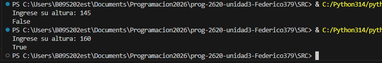

> 🧐 **Pregunta Orientadora:** Piensa en tu día a día. ¿Cuántas veces realizas cálculos mentales (como saber si te alcanza el dinero) o tomas decisiones basadas en condiciones (como "si llueve Y hace frío, llevo abrigo")? ¿Cómo crees que le enseñamos a una computadora a hacer exactamente lo mismo?

**Respuesta**: se lo enseñamos programandola, traducimos nuestra forma de pensar a un algoritmo que se le ingresa a la computadora para que en base a este tome decisiones o haga cosas.

- **1. Operadores Aritméticos 🧮**

Se utilizan para realizar operaciones matemáticas básicas. Funcionan de manera muy similar a la calculadora de tu teléfono.

| **Operador** | **Descripción** | **Ejemplo mental** |
| --- | --- | --- |
| `+` | Suma | `5 + 2 = 7` |
| `-` | Resta | `5 - 2 = 3` |
| `*` | Multiplicación | `5 * 2 = 10` |
| `/` | División (resultado decimal) | `5 / 2 = 2.5` |
| `//` | División entera (ignora decimales) | `5 // 2 = 2` |
| `%` | Módulo (residuo de la división) | `5 % 2 = 1` |
| `**` | Potenciación | `5 ** 2 = 25` |

-***Evidencia actividad***

- **2. Operadores Relacionales (Comparación) ⚖️**

Los operadores relacionales se utilizan para comparar dos valores. El resultado de esta comparación **siempre** será un valor Booleano: `True` (Verdadero) o `False` (Falso).

| **Operador** | **Descripción** | **Ejemplo (`x=5`, `y=10`)** |
| --- | --- | --- |
| `==` | Igual que (¡Ojo! Son dos símbolos `=`) | `x == y` *(False)* |
| `!=` | Diferente que | `x != y` *(True)* |
| `>` | Mayor que | `x > y` *(False)* |
| `<` | Menor que | `x < y` *(True)* |
| `>=` | Mayor o igual que | `x >= 5` *(True)* |
| `<=` | Menor o igual que | `y <= 5` *(False)* |

-***Evidencia actividad***

- **3. Operadores Lógicos 🧠**

A veces no basta con hacer una sola pregunta; necesitamos evaluar múltiples condiciones al mismo tiempo. Aquí entran los operadores lógicos.

| **Operador** | **Descripción** | **¿Cuándo es `True`?** |
| --- | --- | --- |
| `and` | Y lógico | Solo si **AMBAS** condiciones son verdaderas. |
| `or` | O lógico | Si **AL MENOS UNA** de las condiciones es verdadera. |
| `not` | NO lógico (Inversión) | Invierte el valor (de `True` a `False` y viceversa). |

-***Evidencia actividad***

